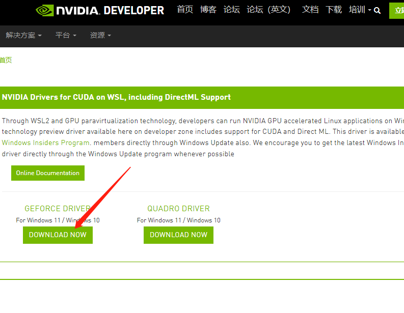

> 本文作者: [WGB](https://wgb5445.github.io/)

          Twitter: [WGB5445](https://twitter.com/WGB5445)


### 所需工具

- Windows 电脑
- 10 系以上显卡
- 网络

### 操作过程

1. 升级 Windows 系统为预览版
2. 安装 WSL2 内核、安装或升级 WSL ubuntu 为 WSL2
3. 安装显卡的 WSL 驱动
4. 下载 ubuntu 上必要的工具
5. 安装 ubuntu 的 cuda 工具
6. 下载源码
7. 编译
8. 执行
9. 修改浏览器设置
10. 成功开图

## 一、升级 Windows 系统为预览版或 Windows11

为了在 WSL2 上启用 NVIDIA CUDA，需要将系统升级为 Windows 10 的 Windows 预览体验计划或者 Windows 11  
对于 Windows 10，需要先注册 Windows 预览体验计划，并升级预览体验成员版本  
需要升级为 windows10 预览版内部版本 19044.1263 或更高版本  
可以按照微软官方的步骤进行注册升级  
[https://insider.windows.com/zh-cn/getting-started#register](https://insider.windows.com/zh-cn/getting-started#register)

## 二、安装 WSL2 内核以及 Ubuntu

在升级为预览版以后 WSL2 就可以支持调用显卡资源，安装 WSL2 以及 Ubuntu 可以使用命令一键安装，也可以手动逐个安装

### 1. 完整的安装步骤

可以使用官网步骤进行下载并安装  
[https://docs.microsoft.com/zh-cn/windows/wsl/install](https://docs.microsoft.com/zh-cn/windows/wsl/install)

### 2. 一键安装

也可以使用命令行进行简便安装

```PowerShell
wsl --install
```

此命令将启用所需的可选组件，下载最新的 Linux 内核，将 WSL 2 设置为默认值，并安装 Linux 发行版（默认安装 Ubuntu）。

## 三、安装 WSL-Cuda 驱动

由于系统默认不提供显卡-WSL2 的驱动，所以需要自行下载驱动，可以从英伟达官网进行下载  
[https://developer.nvidia.com/cuda/wsl](https://developer.nvidia.com/cuda/wsl)

### 1. 选择 Get CUDA Driver


### 2. 下载

根据显卡型号选择对应驱动  


### 3. 安装

下载后，按默认方法安装即可

## 四、Ubuntu 上下载必要工具

由于接下来需要编译代码，所以需要安装一系列的工具进行编译
**注意:如果已经有编译好的 df-explorer 可以跳过**

### 1. 设置密码

新下载的 Ubuntu 需要等待安装一小会后，设置用户名及其密码  
设置用户名及其密码的过程需要注意:

- 输入用户名后回车即可
- 输入密码时屏幕不显示字符
- 输入完成后直接回车即可
- 再次输入密码即可进入 Ubuntu 系统中

### 2. 安装工具

这一步使用命令行进行安装，安装需要良好的网络环境  
国内用户可以选择国内镜像源安装，速度可达 3MB 每秒
输入命令后可能需要输入密码，密码为上一小步设置的密码

```
sudo apt install -y git libgmp-dev cmake openssl libssl-dev nvidia-cuda-toolkit
```

## 五、下载 CUDA 工具包

为了在 Ubuntu 下编译 CUDA 的程序，需要安装 CUDA 工具包
所需的安装包可以在英伟达官网链接中获取(官网中同样是通过命令行的方式获取)
[官网链接](https://developer.nvidia.com/cuda-downloads?target_os=Linux&target_arch=x86_64&Distribution=WSL-Ubuntu&target_version=2.0&target_type=deb_local)  
这一步需要依次执行下列命令

```sh
wget https://developer.download.nvidia.com/compute/cuda/repos/wsl-ubuntu/x86_64/cuda-wsl-ubuntu.pin
```

```sh
sudo mv cuda-wsl-ubuntu.pin /etc/apt/preferences.d/cuda-repository-pin-600
```

```sh
wget https://developer.download.nvidia.com/compute/cuda/11.5.1/local_installers/cuda-repo-wsl-ubuntu-11-5-local_11.5.1-1_amd64.deb
```

```sh
sudo dpkg -i cuda-repo-wsl-ubuntu-11-5-local_11.5.1-1_amd64.deb
```

```sh
sudo apt-key add /var/cuda-repo-wsl-ubuntu-11-5-local/7fa2af80.pub
```

```sh
sudo apt-get update
```

```sh
sudo apt-get -y install cuda
```

如果所有命令均无出错，可以视为安装成功

## 六、下载源码

使用 Git 工具下载最新的 df-explorer 源码

### 1. 下载 core 源码

```sh
git clone https://github.com/guild-w/df-explorer.git
```

### 2. 进入到第三方插件文件夹

```sh
cd df-explorer/thirdparty
```

### 3. 下载 CGBN 源码

```sh
git clone https://github.com/NVlabs/CGBN.git
```

### 4. 下载 workflow 源码

```sh
git clone https://github.com/sogou/workflow.git
```

## 七、编译

编译源码需要使用到之前下载的工具包，同样是执行命令

### 1. 编译 workflow

```sh
cd workflow && make
```

### 2. 回到 df-explorer 目录

```sh
cd ../../
```

### 3. 创建 build 文件夹并进入

```sh
mkdir build && cd build
```

### 4. 编译 Release 版 df-explorer

```sh
cmake .. -DCMAKE_BUILD_TYPE=Release
make
```

最后在文件夹中生成 df-explorer 文件，可以使用 ls 命令查看

```sh
ls
```

出现

```
CMakeCache.txt  CMakeFiles  Makefile  cmake_install.cmake  df-explorer  samples
```

里面的 df-explorer 就是最终的可执行文件

## 八、运行 df-explorer

成功编译了 df-explorer 后，可以使用./def-explorer 的方式运行软件

```sh
./df-explorer
```

如果成功出现以下的提示则为成功(运行成功后界面不可关闭，否则程序将中断)

```
cuda block size :128
cuda device id: 0
start server on port 8880
```

## 九、浏览器开启不安全内容权限

由于 DF 游戏网页采用 HTTPS 协议，但是开图程序使用 http 协议，在默认的浏览器设置中不可以在 HTTPS 的网页中带有 HTTP 协议的请求  
所以需要修改浏览器设置，并对 DF 的游戏网页设置不安全内容权限

### 1. chrome

对于 Chrome 用户可以访问以下链接设置不安全内容权限

```
chrome://settings/content/insecureContent
```

在"允许显示不安全内容"的栏中添加 DF 网址后刷新网页即可

### 2. Edge

对于 Edge 用户可以访问以下链接设置不安全内容权限

```
edge://settings/content/insecureContent
```

在"允许"的栏中添加 DF 网址后刷新网页即可

## 十、remote-explorer 插件添加链接

由于是本机链接，所以添加如下链接即可开图

```
http://localhost:8880/explore
```
